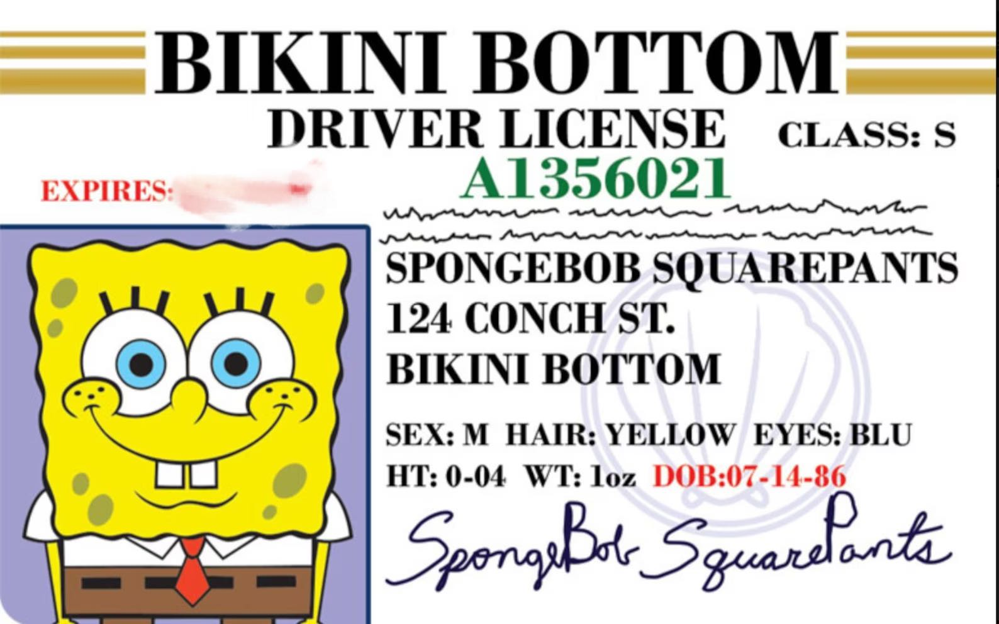

#HI~~~~~~~~~

This is Yang Zhao's website

## Summary

I am a current master student of Master of Science in Biostatistics at Columbia University. My previous research direction focused on Control Chart, Data Science Application in Social Science and Optimization in Algorithm. I am still wondering my research direction in the not distant future. Here comes my resume.

## Education

- Degree: MS Biostatistics
- Institution: Columbia University
- Graduation Year: 2025

## Projects

### Analysis of Influencing Factors for the Birth Rate (From the Perspecti OF FAMILY PLANNING AND SOCIAL SECURITY)

-	Advised on improving and implementing governmental policies on fertility incentives in the Greater Bay Area to the Pilot Free Trade Zone Nansha Area of Guangzhou

### Study on Methods For Predicting Commodity Sales Amid the COVID-19 Pandemic 

-	Collected nearly 40,000 pieces of sales data on 20 categories of daily necessities between 2016 and 2020, studied methods for predicting product sales, and built an X12-Arima model with R 

## Award

- The Chinese National Scholarship
-	The University Excellent Student Scholarship
- Dean's List
-	The University Excellent Student Scholarship

## Skills

- SPSS
- Matlab
- R
- SQL
- Python
- C

## Languages

- English
- Cantonese
- Mandarin